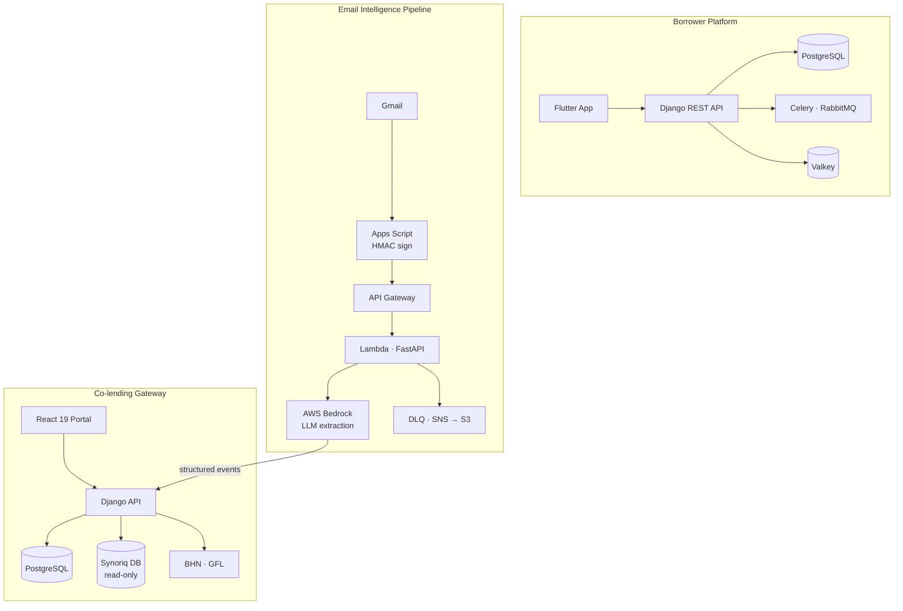

### Sahil Sonker

**SDE I · Optimo Capital**

Backend engineer at a fintech NBFC. I design and ship production systems across the full lending stack — REST APIs, async pipelines, internal tooling, and a borrower-facing mobile app. My work sits at the intersection of clean service architecture, operational reliability, and integrating LLMs into real financial workflows.

---

**What I'm shipping**

| Project | What it does | Stack |
|---|---|---|
| **Optimo App** | Borrower-facing mobile lending platform | Django · DRF · Flutter · PostgreSQL |
| **Co-lending Gateway** | Ops portal routing loan applications to partner lenders (BHN, GFL) | Django · React 19 · TypeScript · SQLAlchemy |
| **Email Intelligence Pipeline** | Event-driven pipeline extracting structured data from operational emails via LLMs | FastAPI · AWS Lambda · AWS Bedrock · Pydantic v2 |

---

**Stack**

---

**Focus areas**

- Layered service architecture — routes → services → repositories, consistent across Django, FastAPI, and Go
- Resilience patterns — circuit breakers, retry with exponential backoff, Lua-atomic rate limiters, SSRF guards
- RBAC — resource-scoped roles and permissions with JWT-based auth
- LLM pipelines — HMAC-verified ingestion, Pydantic-validated structured output, DLQ fallback, PII scrubbing
- Observability — OpenTelemetry tracing, Prometheus metrics, structured JSON logging with request-id propagation

---

**Currently**

Building out the field-config system in the co-lending portal — a dynamic form engine where each field carries its own visibility conditions, validation rules, and edit permissions, driven by config rather than hardcoded UI logic. The goal is ops teams being able to reconfigure what loan data surfaces for a partner without a code deploy.

---

**System architecture**

The three systems I work on are interconnected — the email pipeline feeds structured events directly into the co-lending gateway.

---

